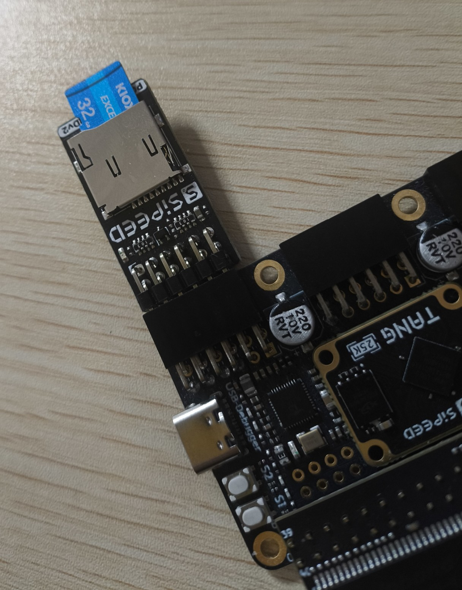
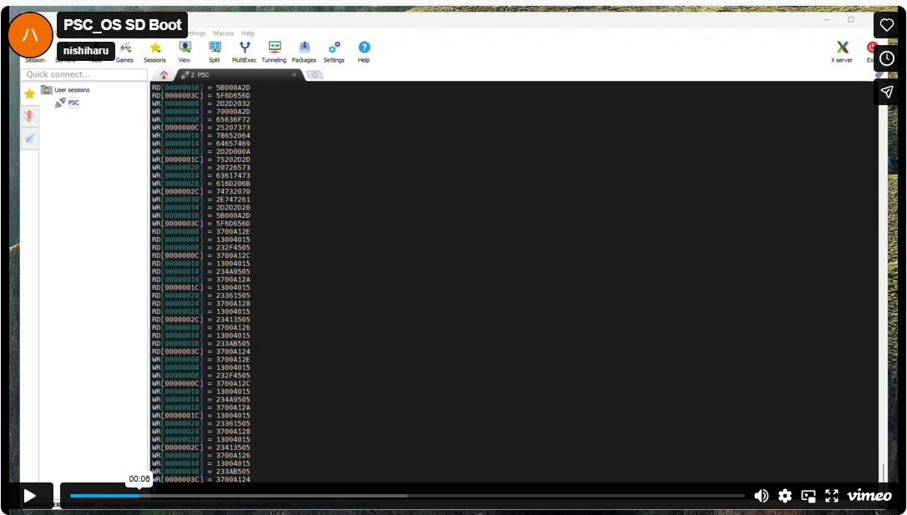

# PSC-ONE

An open-source full-stack RISC-V SoC platform for FPGA-based edge computing and system-level experimentation.

It integrates a custom CPU, memory system, peripherals, and operating system into a single cohesive architecture, enabling end-to-end hardware/software co-design.

## What is PSC-ONE?

PSC-ONE is an open-source full-stack RISC-V SoC project developed by QPSC-Design.

It aims to build a fully custom edge computing platform from the ground up, including the following components:

- A custom RV32-based RISC-V CPU core
- A memory subsystem, including an SDRAM controller and MMU-ready architecture
- An SD card boot and storage interface
- Memory-mapped peripheral interfaces
- An AI acceleration engine, SynapEngine, based on a systolic array architecture
- Custom OS integration

PSC-ONE is not just a CPU core, but a complete experimental SoC platform for research, edge AI development, and architectural exploration.

---

## Repository Structure

- `hardware/` - FPGA RTL design, including the CPU core, memory subsystem, and peripherals
- `software/` - PSC_OS, boot code, and user-side software
- `docs/` - Architecture diagrams and supporting documentation

---

## Hardware Components

The hardware side of PSC-ONE currently includes:

- `PSC_RV32ISP` custom RISC-V CPU core
- SDRAM controller
- SD card interface (SPI mode)
- Memory-mapped peripheral system
- SynapEngine AI accelerator

---

## Software Stack

The software side of PSC-ONE currently includes:

- `PSC_OS`, a custom operating system for the platform
- Boot and initialization flow for FPGA-based execution
- User programs and runtime experiments, including UART-based output demos

---

## PSC_RV32ISP (CPU Architecture)

This diagram presents the top-level architecture of the PSC system.  
It shows how the `PSC_RV32ISP` CPU core is integrated with memory and peripheral components, including UART, SDRAM, and the SD card interface.  
All components are connected through a memory-mapped architecture, enabling unified control from the CPU.

---

## Demo

### PSC_OS LSD

This video shows a live demonstration of the PSC system running on FPGA hardware.  
It highlights real-time interaction between the CPU, SD card interface, and UART output.  
The system successfully boots and executes software on a fully integrated hardware platform.

---

### PSC_OS Boot

This video demonstrates the PSC system running `PSC_OS` on FPGA hardware.  
It shows prime number computation executed on the custom `PSC_RV32ISP` CPU, with results transmitted over UART.  
The demo highlights a fully functional hardware-software stack, from boot to program execution.

---

### PSC_OS Boot from SD Card.

This video demonstrates the PSC system booting PSC_OS from an SD card on FPGA hardware.  
It shows the SD interface operating in serial mode, with CRC checks performed during data transfer.  
In case of errors, the system automatically retries the read operation, ensuring reliable boot execution from external storage.  

---

## Getting Started

A more detailed setup guide will be added as the project evolves.  
At a high level, the workflow is as follows:

1. Build the hardware design
2. Program the FPGA
3. Prepare the boot image or software binaries
4. Run the system and observe output through the available interfaces

---

## 🚧 Work in Progress

This project is actively under development.  
Features, architecture, interfaces, and documentation may change as the design evolves.
