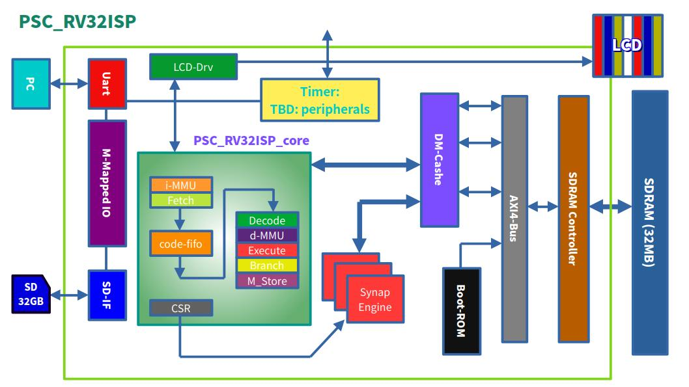
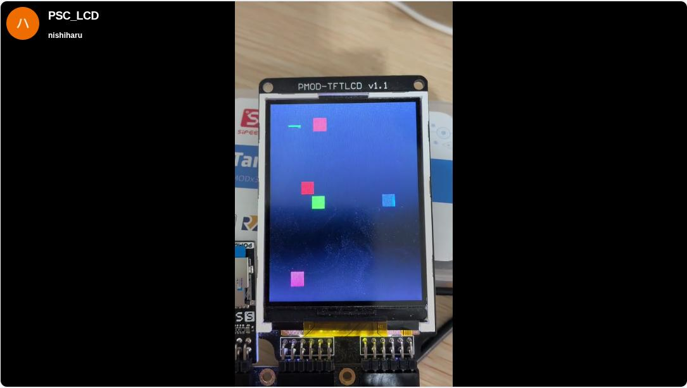
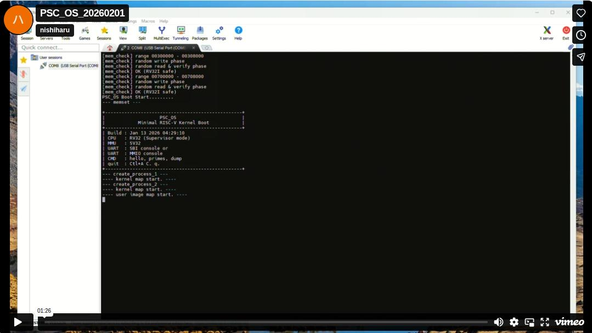

# PSC-ONE

PSC-ONE is an open-source full-stack RISC-V SoC platform for FPGA-based edge computing and system-level experimentation.  
It integrates a custom CPU, memory system, peripherals, and OS into a single cohesive architecture, enabling end-to-end hardware/software co-design.

## What is PSC-ONE?

PSC-ONE is an open-source full-stack RISC-V SoC project developed by QPSC-Design.

It aims to build a fully custom edge computing platform from the ground up, including:

- A custom RV32-based RISC-V CPU core
- Memory subsystem (SDRAM controller, MMU-ready architecture)
- SD card boot and storage interface
- Peripheral interfaces
- AI acceleration engine (SynapEngine, based on a systolic array architecture)
- Custom OS integration

PSC-ONE is not just a CPU core, but a complete experimental SoC platform for research, edge AI development, and architectural exploration.

---

## PSC_RV32ISP

This diagram presents the top-level architecture of the PSC system.  
It highlights how the CPU core is integrated with memory and peripheral components, including UART, SDRAM, and the SD card interface.  
All components are connected through a memory-mapped interface, enabling unified control from the CPU.

---

## Demo

This video shows a live demonstration of the PSC system running on FPGA hardware.  
It highlights real-time interaction between the CPU, SD card interface, and UART output.  
The system successfully boots and executes software on a fully integrated hardware platform.

This video demonstrates the PSC system running PSC_OS on FPGA hardware.  
It shows prime number computation executed on the custom PSC_RV32ISP CPU, with results transmitted over UART.  
The demo highlights end-to-end operation of the hardware and software stack.

---

## 🚧 Work in Progress

This project is actively under development. Features, architecture, and interfaces may change as the design evolves.
