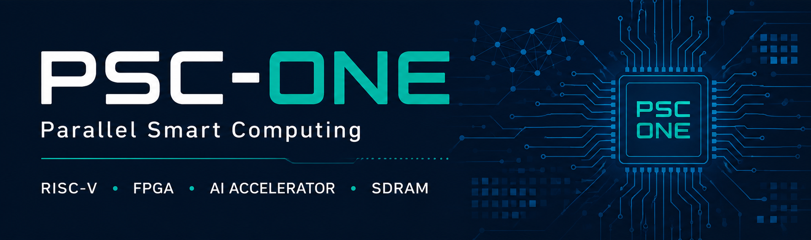
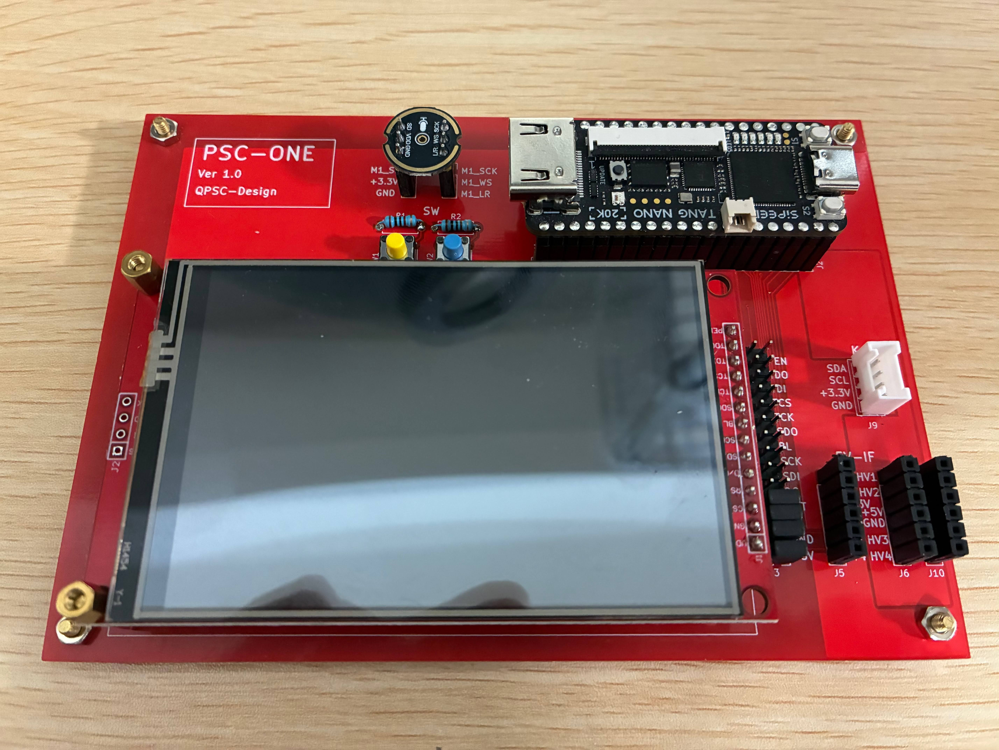
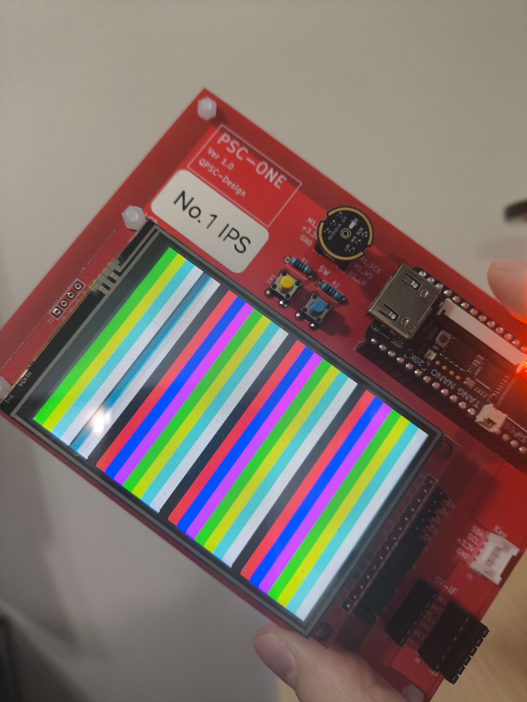
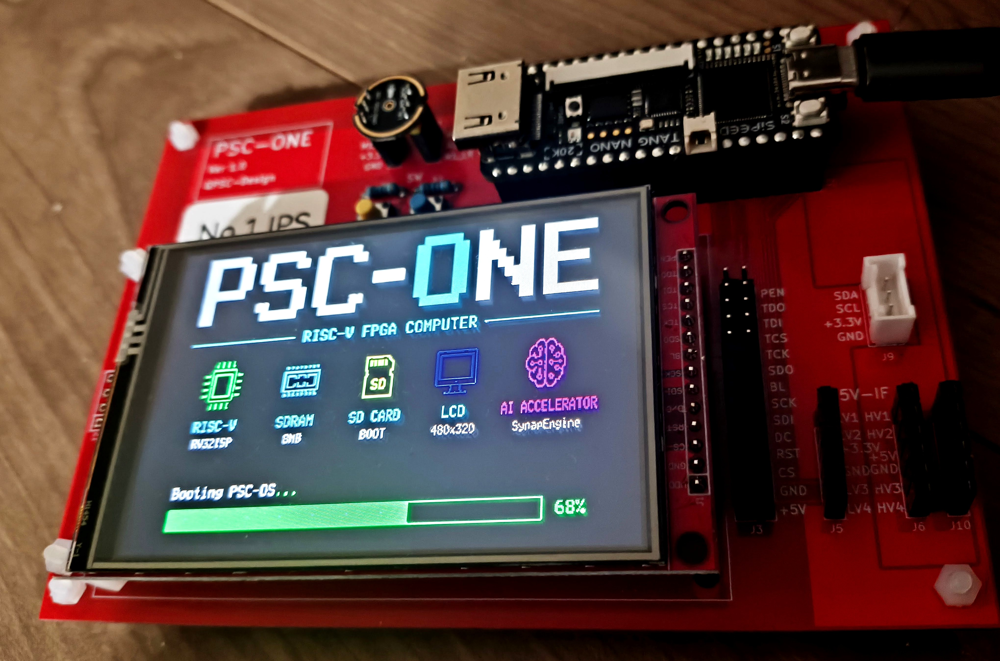
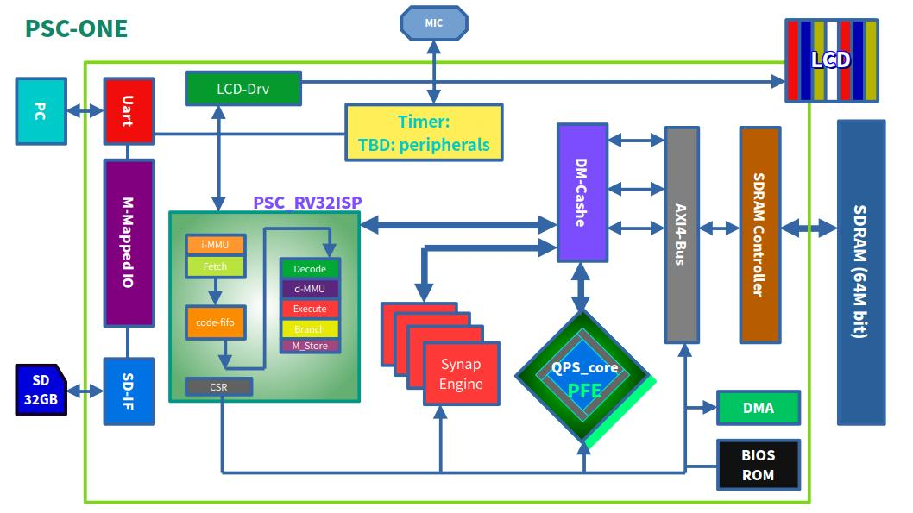
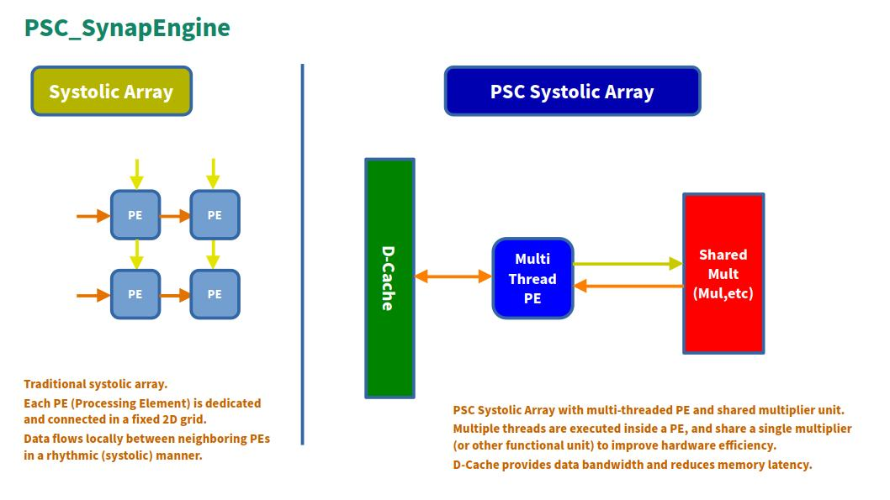
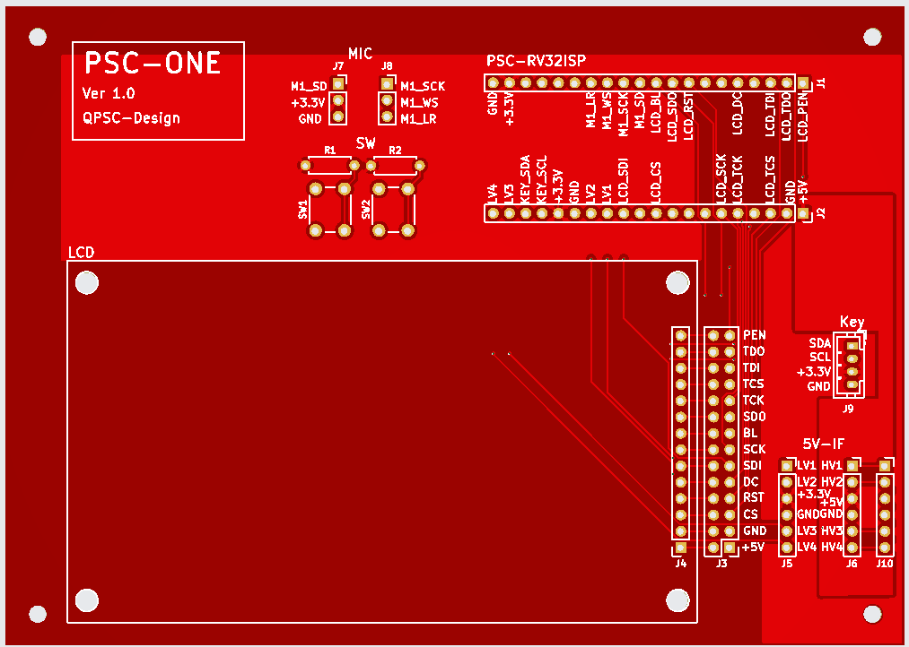
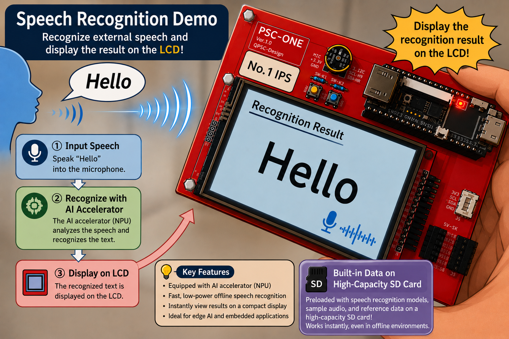
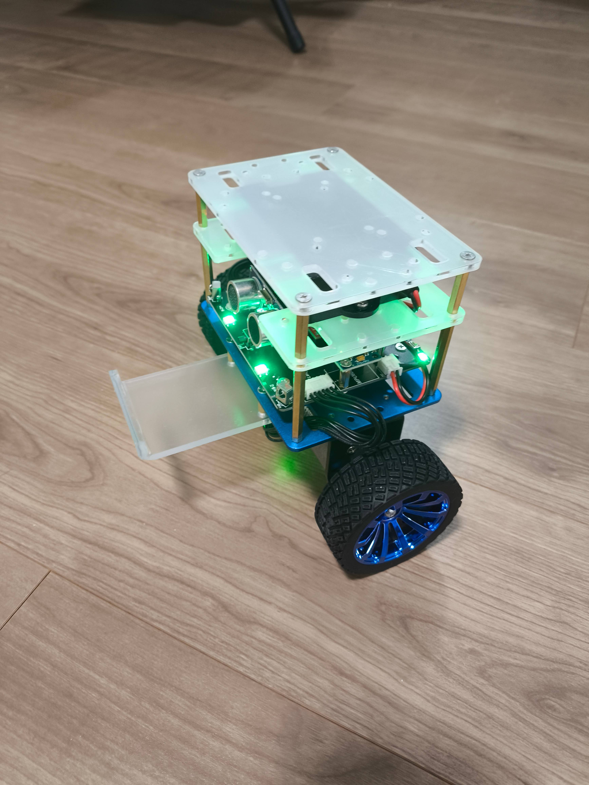

<p align="center">
  <a href="https://github.com/QPSC-Design/PSC-ONE">
    
  </a>
</p>

# PSC-ONE

An open-source full-stack RISC-V SoC platform for FPGA-based edge computing and AI acceleration.  
PSC-ONE integrates a custom CPU, memory subsystem, peripherals,
operating system, and AI accelerator into a unified architecture,
enabling end-to-end hardware/software co-design.

The SynapEngine accelerator is controlled directly through custom
RISC-V CSR registers and accesses matrix data through the shared
cache/memory subsystem. This reduces explicit data transfers and
redundant memory copies during matrix operations and future neural-network workloads.
  
The current PSC-ONE prototype hardware.  
  


The displayed color bars are generated directly by the PSC-ONE hardware and confirm correct operation of the LCD subsystem.　



The PSC-ONE boot logo rendered on the actual FPGA hardware during system startup, demonstrating successful LCD initialization and graphics output.  



## What is PSC-ONE?

PSC-ONE is an open-source full-stack RISC-V SoC project developed by QPSC-Design.

It aims to build a fully custom edge computing platform from the ground up, including the following components:

- A custom RV32-based RISC-V CPU core
- A memory subsystem, including an SDRAM controller, caches, and an Sv32 MMU
- An SD card boot and storage interface
- Memory-mapped peripheral interfaces
- An AI acceleration engine, SynapEngine, based on a systolic array architecture
- A custom operating system, PSC-OS

PSC-ONE is not just a CPU core, but a complete experimental SoC platform for research, edge AI development, and architectural exploration.

---

## Repository Structure

- `hardware/` - FPGA RTL design, including the CPU core, memory subsystem, and peripherals
- `software/` - PSC-OS, boot code, and user-side software
- `docs/` - Architecture diagrams and supporting documentation

---

## Hardware Components

The hardware side of PSC-ONE currently includes:

- `PSC_RV32ISP` custom RISC-V CPU core
- SDRAM controller
- SD card interface (SPI mode)
- Memory-mapped peripheral system
- SynapEngine AI accelerator

---

## Software Stack

The software side of PSC-ONE currently includes:

- `PSC-OS`, a custom operating system for the platform
- Boot and initialization flow for FPGA-based execution
- User programs and runtime experiments, including UART-based output demos

---

## PSC_RV32ISP (CPU Architecture)

This diagram presents the top-level architecture of the PSC system.  
It shows how the PSC_RV32ISP CPU core is integrated with memory and peripheral components, including UART, SDRAM, and the SD card interface.  
Most peripherals are connected through memory-mapped interfaces.
The SynapEngine accelerator is controlled directly through custom RISC-V
CSR registers and accesses matrix data through the shared cache/memory subsystem.
  
A key feature of the PSC architecture is the tightly coupled integration of the SynapEngine accelerator with the CPU.  
Both the PSC_RV32ISP core and the SynapEngine access memory through
the shared cache and memory subsystem.
Unlike loosely coupled accelerator designs that require explicit DMA transfers
for every operation, SynapEngine can directly access data through the shared
cache/memory subsystem, reducing redundant memory copies.
  
This tightly coupled architecture improves overall efficiency by reducing memory access overhead and is particularly suitable for data-intensive workloads such as matrix operations and future neural-network inference.



---

## PSC_RV32ISP vs PicoRV32 (Yosys Analysis)

### Resource Comparison

| Metric           | PSC_RV32ISP          | PicoRV32 |
|------------------|----------------------|----------|
| Cells            | 1385                 | 515      |
| Adders           | 15                   | 8        |
| Subtractors      | 4                    | 3        |
| Multipliers      | **3**                | **0**    |
| Multiplexers     | 377                  | 148      |
| Comparators      | 354                  | 69       |
| Registers (FF)   | 217                  | 105      |

---

## Architectural Features

| Feature                       | PSC_RV32ISP | PicoRV32 |
| ----------------------------- | :---------: | :------: |
| RV32I                         |      ✓      |     ✓    |
| Zicsr / CSR Support           |      ✓      | Optional |
| RV32M MUL/DIV/REM             |      ✓      | Optional |
| Privilege Modes (M/S/U)       |      ✓      |     ✗    |
| Sv32 MMU                      |      ✓      |     ✗    |
| Instruction FIFO              |      ✓      |     ✗    |
| Fetch/Execute Separation      |      ✓      |     ✗    |
| RAW Hazard Detection          |      ✓      |     ✗    |
| Load-Use Stall                |      ✓      |     ✗    |
| Pipeline Execution            |   Partial   |     ✗    |
| Instruction Cache             |      ✓      |     ✗    |
| Data Cache                    |      ✓      |     ✗    |

> Resource counts are based on generic Yosys RTL cells before FPGA
> technology mapping. PicoRV32 results depend on the selected configuration.
> Multiplexer counts include Yosys `$mux` cells only and exclude `$pmux` cells.

---

# PSC-ONE AI

PSC-ONE AI is a hardware accelerator platform for matrix multiplication (GEMM),
built around a custom systolic-array architecture.

It is part of the broader PSC-ONE experimental SoC platform,
which integrates:

- Custom RISC-V CPU
- Memory subsystem
- AI accelerator
- Hardware/software co-design environment

The project focuses on exploring efficient dataflow architectures
under constrained memory bandwidth for edge AI systems.

---

## PSC-ONE AI Architecture



The system integrates the SynapEngine systolic array
with the PSC-ONE SoC platform.

---

## PSC-ONE AI Features

- 4×4 INT8 systolic array
- Output-Stationary (OS) dataflow
- Direct control through custom RISC-V CSR registers
- Direct matrix data access through the CPU cache/memory subsystem
- Integrated with the custom PSC-RV32ISP processor
- Experimental hardware/software co-design platform

---

## Systolic Array and PicoRV32 Resource Scale Comparison

### Resource Comparison

| Metric         | Systolic Array (4×4) | PicoRV32 |
| -------------- | -------------------: | -------: |
| Cells          |                  555 |      515 |
| Multipliers    |                **2** |    **0** |
| Adders         |                   25 |        8 |
| Multiplexers   |                  113 |      148 |
| Registers (FF) |                   88 |      105 |
| Control Logic  |             Moderate |     High |

> Multiplexer counts include Yosys `$mux` cells only and exclude `$pmux` cells.

- A **dataflow-oriented compute engine (Systolic Array)**
- A **control-oriented general-purpose CPU (PicoRV32)**

---

## PSC-ONE AI Goals

This project is not intended to compete with commercial AI accelerators.

Instead, the goal is to explore:

- Dataflow-oriented accelerator design
- Memory bandwidth optimization
- Small-scale AI hardware prototyping
- Hardware/software integration techniques
- Experimental SoC architecture research

---

## PSC-ONE AI Future Work

- Manufacturing a demonstration FPGA board
- Voice recognition demo using the AI accelerator
- Robot control using PSC-ONE AI
- Expansion of the systolic array architecture
- DMA and memory subsystem improvements

---

# Demo

## PSC-OS LCD Demo

This video shows a live demonstration of the PSC system running on FPGA hardware.  
It highlights real-time interaction between the CPU, SD card interface, and UART output.  
The system successfully boots and executes software on a fully integrated hardware platform.

[](https://youtube.com/shorts/aRCHluWXozY?si=T0kp_dv_nBH07tnj)

---

## PSC-OS Boot

This video demonstrates the PSC system running `PSC-OS` on FPGA hardware after boot.  
It shows prime number computation executed on the custom `PSC_RV32ISP` CPU, with results transmitted over UART.  
The demo highlights a fully functional hardware-software stack, from boot to program execution.

[](https://youtu.be/lV74ni7FAt4?si=_Xm8yCdqHN_oQzrs)

---

## PSC-OS Boot from SD Card

This demo uses a Kioxia 32GB SD card for storage.


This video demonstrates the PSC system booting PSC-OS from an SD card on FPGA hardware.  
It shows the SD interface operating in serial mode, with CRC checks performed during data transfer.  
If an error is detected, the system automatically retries the read operation, ensuring reliable boot execution from external storage.  

[](https://youtu.be/FILxQiaqKrk?si=9KQKO3LVkketo0ZM)

---

# Development Status

## Hardware

### CPU
- [x] RV32I Base Integer Instruction Set
- [x] RV32M Multiply/Divide Extension
- [x] Zicsr and Zifencei Extensions
- [ ] Full Pipeline Execution
- [x] Partial Pipeline Execution for selected instruction types
- [x] Branch Instructions
- [x] Load / Store Instructions
- [x] CSR Support
- [x] ECALL / SRET Support
- [x] MMU (Sv32)
- [ ] Interrupt Controller

### Memory System
- [x] SDRAM Controller
- [x] AXI4 Memory Interface
- [x] Cache Controller
- [x] Virtual Memory Support
- [x] DMA Engine

### AI Accelerator
- [x] SynapEngine Architecture
- [x] 4×4 INT8 Systolic Array
- [x] Matrix Multiplication API
- [x] Shared Memory Integration
- [ ] Larger Systolic Array
- [ ] Quantized Neural Network Inference

### Peripherals
- [x] UART
- [x] LED Controller
- [x] Timer
- [x] SD Card (SPI Mode, Read)
- [x] SD Card (SPI Mode, Write)
- [x] LCD Controller
- [ ] Ethernet
- [ ] USB

## Software

### PSC-OS
- [x] Bootloader
- [x] FAT32 Bootloader
- [x] Kernel
- [x] User Mode Execution
- [x] System Call Interface
- [x] Command Shell
- [x] Memory Management
- [x] SD Card Driver
- [x] SD Card Program Loader
- [x] FAT32 File System
- [ ] Networking Stack

### Device Drivers
- [x] UART
- [x] Timer
- [x] SDRAM Controller
- [x] LCD Controller (ILI9488)
- [x] I2S Microphone Interface
- [x] Systolic Array Accelerator

### Applications
- [x] Prime Number Benchmark
- [x] Matrix Multiplication Demo
- [x] SDRAM Test
- [x] SD Card Test
- [x] FAT32 File Browser (`ls`, `cat`)
- [x] FAT32 File Write
- [ ] AI Inference Demo
- [ ] Audio Processing Demo
- [ ] Speech Recognition Demo

## Verification

### Simulation
- [x] Icarus Verilog
- [x] Verilator
- [x] Cocotb Test Environment
- [x] CPU Instruction Tests
- [x] SDRAM Tests
- [x] MMU Tests
- [x] PSC-OS Boot Test

### FPGA
- [x] Tang 20K
- [x] SDRAM Boot
- [x] PSC-OS Boot
- [x] UART Console
- [x] SD Card Boot
- [x] SynapEngine Execution
- [ ] Long-Term Stability Test

## Documentation

- [x] Project Overview
- [x] Build Instructions
- [x] Simulation Guide
- [x] Hardware Architecture
- [ ] Software Architecture
- [ ] Developer Guide
- [ ] API Reference

## Future Goals

- [ ] PSC-ONE v1.0 Release
- [ ] Neural Network Inference on SynapEngine
- [ ] Audio Recognition Demo
- [ ] Self-Balancing Robot Demo
- [ ] Custom ASIC Prototype

---

# Future Work

## Demonstration FPGA board

A demonstration FPGA board is currently under development.
Future work includes speech recognition and robotic control using the AI accelerator.



## Speech Recognition Demo

This demo showcases real-time speech recognition running on the PSC-ONE platform.  
An external microphone captures voice input, which is processed by the onboard SynapEngine AI accelerator. The recognized text is then displayed directly on the LCD screen in real time.  



## Demonstration Robot

A demonstration of a two-wheeled self-balancing robot controlled by the PSC-ONE board is also planned



## PFE

### PSC-ONE Phase Flow Engine

The PSC-ONE Phase Flow Engine is an experimental hardware accelerator architecture developed as part of the PSC project.
It is designed for future AI, signal-processing, and data-flow computing research on the PSC-ONE platform.

Location:

```text
hardware/pfe/
```

---

# Getting Started

A more detailed setup guide will be added as the project evolves.  
At a high level, the workflow is as follows:

1. Build the hardware design
2. Program the FPGA
3. Prepare the boot image or software binaries
4. Run the system and observe output through the available interfaces

---

# Repository Status

This repository is an experimental research project
and is under active development.

RTL, software, and architecture may change frequently.

---

# License

MIT License

---

## 🚧 Work in Progress

This project is actively under development.  
Features, architecture, interfaces, and documentation may change as the design evolves.
