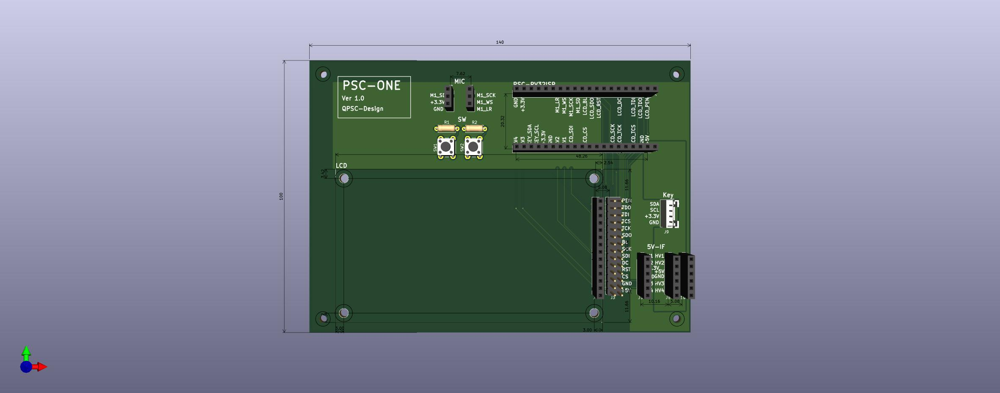

# PSC-ONE 

## Design

The current PSC-ONE prototype hardware.  
  

## Purpose

PSC-ONE is a hardware evaluation and demonstration platform for the PSC project.

The board is designed to verify and validate the functionality of the PSC CPU, operating system, memory subsystem, peripherals, and AI acceleration technologies in a real hardware environment.

It also serves as a demonstration platform for various embedded applications, including:

- Voice recognition
- AI inference
- Graphics and display control
- Sensor integration
- Real-time embedded systems

## Features

- Custom PSC RISC-V CPU
- PSC-OS operating system support
- SDRAM memory interface
- LCD display interface
- Optional touch panel support
- SD card storage interface
- UART debugging console
- GPIO expansion
- AI accelerator integration support

## License

Hardware design files, schematics, PCB layouts, and related documentation are licensed under CERN-OHL-S v2.

Copyright (c) 2026 QPSC-Design
