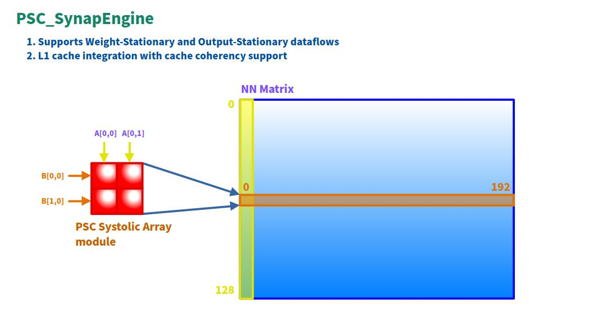

# PSC-ONE AI

PSC-ONE AI is an experimental AI acceleration subsystem designed for the PSC-ONE platform.
It focuses on efficient matrix computation using a systolic array architecture, enabling exploration of modern dataflow-based hardware acceleration techniques.



---

## Overview

PSC-ONE AI integrates a custom systolic array engine (SynapEngine) into the PSC-ONE SoC.

The design emphasizes:

- Dataflow-driven computation
- Tight integration with the memory subsystem
- Full hardware/software co-design capability

It is intended for research, prototyping, and architectural exploration of edge AI systems.

---

## Features

- Custom systolic array-based matrix computation engine
- Support for multiple dataflow strategies:
  - Weight-Stationary
  - Output-Stationary
- Memory-mapped interface for CPU control
- Integration with PSC-ONE SDRAM and cache system
- FPGA-ready design with cocotb-based verification

---

## Dataflow Architecture

PSC-ONE AI supports two major dataflow models:

### Weight-Stationary (WS)

- Weights remain inside processing elements (PEs)
- Input activations stream through the array
- Efficient for weight reuse

### Output-Stationary (OS)

- Partial sums are accumulated locally in each PE
- Inputs (A, B) are streamed diagonally
- Reduces memory write-back bandwidth

---

## Memory System Integration

PSC-ONE AI is tightly coupled with the PSC-ONE memory system:

- Memory-mapped I/O interface
- L1 cache integration
- Cache coherency-aware design

---

## Programming Model

The accelerator is controlled via memory-mapped registers.

Typical workflow:

1. Write matrices A and B to memory
2. Configure operation mode (WS / OS)
3. Start computation
4. Wait for completion
5. Read back results

---

## Directory Structure

```
PSC-ONE/
 └── hardware/
     └── ai/
         ├── src/
         └── docs/
```

---

## Future Work

- Larger systolic arrays (4x4, 8x8)
- DMA support
- Memory bandwidth optimization
- Mixed precision support (fp16 / int8)
- Software stack for AI workloads

---

## License

Same as PSC-ONE project.

---

## Author

QPSC-Design
