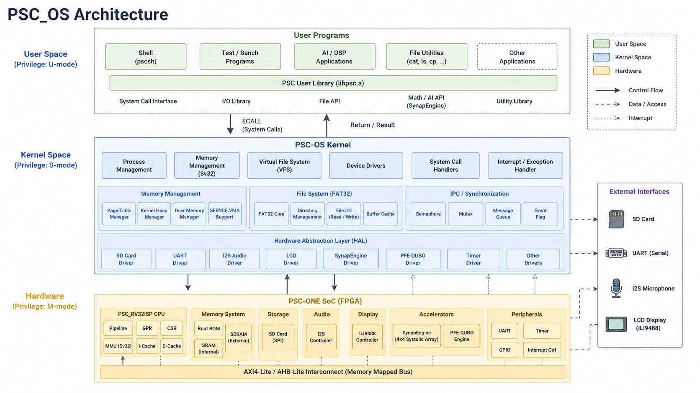

<p align="center">
  <a href="https://github.com/QPSC-Design/PSC-ONE">
    
  </a>
</p>

# PSC-ONE Software

This directory contains the software stack of **PSC-ONE**, a fully custom RISC-V SoC implemented on FPGA.

PSC-ONE includes an original operating system, **PSC-OS**, developed together with the custom PSC_RV32ISP CPU, memory subsystem, peripheral controllers, and hardware accelerators.

The software stack does not depend on Linux, BSD, an existing RTOS, or an external kernel framework.

---

## Overview

PSC-ONE Software is a full-stack software environment designed specifically for the PSC-ONE FPGA SoC.

It includes:

- Boot software
- PSC-OS kernel
- User-mode applications
- System-call interface
- Device-control libraries
- FAT32 filesystem support
- Hardware-accelerator APIs
- Test and diagnostic programs

The figure below illustrates the conceptual PSC-ONE software architecture, including user programs, kernel services, device drivers, and the PSC-ONE hardware platform.



> This diagram presents the conceptual architecture of PSC-OS and PSC-ONE.  
> Some modules shown in the diagram may represent planned or experimental extensions.

All major software components are developed specifically for PSC-ONE and are closely integrated with its custom hardware architecture.

---

## Software Architecture

PSC-OS uses the RISC-V privilege architecture to separate low-level system control, kernel execution, and user applications.

```text
User Applications
       │
       │ ECALL / System Calls
       ▼
PSC-OS Kernel
       │
       │ CSR / MMIO / Memory Access
       ▼
PSC-ONE Hardware
```

The software stack is divided into three execution levels:

- Machine mode for boot and low-level processor control
- Supervisor mode for the PSC-OS kernel
- User mode for applications and the command shell

---

## Key Features

### 1. Fully Custom Operating System

PSC-OS is implemented from scratch for the PSC-ONE platform.

It does not use:

- Linux
- BSD
- An external RTOS
- An existing kernel framework

The boot process, kernel, system calls, user programs, device interfaces, and filesystem support are developed as part of the PSC-ONE project.

This provides direct control over:

- CPU privilege transitions
- Virtual-memory configuration
- Cache behavior
- Device access
- Accelerator control
- Process memory layout
- Hardware/software interfaces

---

### 2. RISC-V Privilege Architecture

PSC-OS operates with the RISC-V Machine, Supervisor, and User privilege modes.

#### Machine Mode

Machine mode is responsible for low-level processor initialization and privileged control.

Current responsibilities include:

- Initial CPU setup
- CSR initialization
- Trap-vector configuration
- Supervisor-mode transition
- Low-level exception handling
- Platform initialization

#### Supervisor Mode

The PSC-OS kernel runs in Supervisor mode.

Kernel responsibilities include:

- System-call handling
- User-program control
- Virtual-memory management
- Page-table management
- Device access
- Filesystem operations
- Hardware-accelerator control
- Exception handling

#### User Mode

The shell and user applications execute in User mode.

User programs access operating-system services through the system-call interface rather than directly controlling privileged CPU resources.

---

### 3. Sv32 Virtual Memory

PSC-OS supports Sv32 virtual memory on the custom PSC_RV32ISP CPU.

Current virtual-memory features include:

- Sv32 page-table translation
- `satp` configuration
- `SFENCE.VMA` support
- Separate kernel and user memory regions
- Page-permission handling
- User-mode address-space protection
- Supervisor-mode kernel execution
- User-program loading into dedicated memory

The current memory layout separates the kernel and user-program regions.

Example physical memory regions include:

```text
Kernel region : 0x0020_0000
User region   : 0x0040_0000
```

The MMU allows PSC-OS to execute user programs in a protected address space instead of running all software with unrestricted hardware access.

---

### 4. Process and User-Program Execution

PSC-OS currently supports basic process execution.

The current configuration includes:

- Idle process
- Interactive shell process
- User-program loading
- User-mode entry
- Program termination through a system call
- Kernel-to-user memory transfer
- Instruction-cache synchronization using `FENCE.I`

The current process model is intentionally small and experimental, but it provides the foundation for future scheduling and multi-process support.

---

### 5. System Call Interface

User programs communicate with the PSC-OS kernel using `ECALL`.

Current system-call services include:

| Number | Service |
| -----: | ------- |
| 1 | Character output |
| 2 | Character input |
| 3 | Character input with timeout |
| 4 | SynapEngine execution |
| 5 | I2S microphone read |
| 6 | SD-card sector read |
| 7 | SD-card sector write |
| 8 | SD-card buffered read |
| 9 | Memory dump |
| 10 | Switch input read |
| 11 | File read |
| 12 | File write |
| 13 | User-program exit |
| 14 | Integer output |

The system-call interface allows user applications to use hardware and filesystem services without directly accessing privileged kernel resources.

---

### 6. Command Shell

PSC-OS includes an interactive command shell.

The shell is used for:

- System testing
- File access
- Memory inspection
- Peripheral testing
- Audio capture
- Accelerator execution
- User-program launch

Current or experimental shell commands include:

```text
hello
primes
dump
sa_start
sd_read
sd_write
mic_read
mic_write
fat32_info
fat32_ls
fat32_cat
exit
```

The shell communicates through the PSC-ONE UART console.

---

### 7. FAT32 Filesystem

PSC-OS includes native FAT32 filesystem support.

Current FAT32 features include:

- FAT32 volume detection
- Partition-information parsing
- Root-directory access
- Directory-entry parsing
- File lookup
- File reading
- File writing
- SD-card sector access
- Kernel-image loading
- User-program loading
- Audio-data storage

The filesystem is implemented directly for PSC-OS and does not use an external FAT library or operating-system framework.

---

### 8. SD-Card Support

PSC-OS controls the PSC-ONE SPI-mode SD-card controller.

Current software support includes:

- SD-card initialization
- Single-sector reads
- Single-sector writes
- Buffered data transfer
- FAT32 filesystem access
- Kernel and user-image loading
- Application-data storage
- Microphone-recording storage

The SD card acts as both boot storage and a general-purpose filesystem device.

---

### 9. Hardware-Accelerator Support

PSC-OS provides software interfaces for custom PSC-ONE accelerators.

#### SynapEngine

SynapEngine is the PSC-ONE matrix-processing accelerator.

PSC-OS support includes:

- Input-matrix preparation
- Matrix base-address configuration
- Accelerator start control
- Completion polling
- Result-matrix retrieval
- CPU and hardware result comparison
- Larger matrix processing using 4×4 tiling

The current SynapEngine configuration uses:

- 4×4 logical systolic array
- int8 input operands
- Output-Stationary dataflow
- 32-bit partial sums
- Shared external multipliers
- Virtualized PE execution

#### PFE QUBO Engine

PSC-OS also supports the experimental PFE QUBO accelerator.

Software operations include:

- QUBO coefficient setup
- Binary-variable setup
- Hardware execution
- Energy-result readback
- Accelerator-status access

---

### 10. I2S Audio Support

PSC-OS supports audio capture through the PSC-ONE I2S receiver.

The current audio configuration includes:

- Mono input
- 16 kHz sampling
- 24-bit I2S samples
- FIFO-based reception
- Buffered sample capture
- SD-card recording

The audio path is intended for future speech-recognition and DSP applications.

---

### 11. Display and Peripheral Support

PSC-OS provides low-level access to PSC-ONE peripherals, including:

- UART
- ILI9488 LCD
- I2S microphone interface
- SD-card controller
- Switch inputs
- Timers
- SynapEngine
- PFE QUBO engine

Peripheral interfaces use memory-mapped registers provided by the PSC-ONE hardware.

---

### 12. Hardware/Software Co-Design

PSC-OS is developed together with the PSC-ONE CPU and SoC hardware.

This enables software to directly test and control:

- Custom RISC-V instructions
- Privilege-mode transitions
- CSR behavior
- Sv32 page translation
- Cache operation
- Memory-mapped peripherals
- Custom accelerators
- FPGA-specific interfaces

Hardware and software can therefore be modified together without compatibility constraints imposed by an existing operating system.

This makes PSC-ONE suitable for experiments in:

- CPU architecture
- Operating-system design
- Memory systems
- Hardware accelerators
- Edge-AI systems
- Embedded signal processing
- Hardware/software co-design

---

## Boot Flow

A typical PSC-ONE boot sequence is:

```text
1. Reset
2. Execute boot ROM
3. Initialize CPU and hardware
4. Initialize SD card
5. Locate kernel and user images
6. Copy images into SDRAM
7. Configure privilege and memory-management state
8. Start PSC-OS kernel
9. Configure user address space
10. Enter the PSC-OS shell
```

PSC-OS can then load and execute user-mode applications from the SD card or system memory.

---

## Verification

PSC-ONE Software is tested together with the RTL implementation.

Current verification methods include:

- Full SoC simulation
- cocotb-based hardware tests
- CPU instruction tests
- Privilege-mode tests
- System-call tests
- Sv32 address-translation tests
- SD-card read/write tests
- FAT32 file-access tests
- Kernel boot tests
- User-program execution tests
- SynapEngine result comparison
- PFE accelerator tests
- FPGA hardware execution

This full-stack verification approach allows the CPU, kernel, peripherals, and accelerators to be tested as one integrated system.

---

## Directory Structure

```text
PSC-ONE/
└── software/
    ├── os/
    ├── tools/
    └── docs/
```

The exact directory and filename organization may change as development continues.

---

## Current Status

The current PSC-OS implementation supports:

- Original custom kernel
- Machine, Supervisor, and User modes
- Sv32 virtual memory
- Kernel and user memory separation
- Basic process execution
- Interactive command shell
- ECALL-based system calls
- SD-card sector read and write
- FAT32 file reading and writing
- Kernel and user-image loading
- UART console
- LCD output
- I2S microphone capture
- SynapEngine matrix acceleration
- PFE QUBO acceleration
- Full FPGA execution
- Full SoC simulation

---

## Future Work

Planned or possible extensions include:

- Improved process scheduling
- Additional concurrent processes
- Dynamic memory allocation
- Expanded user-space libraries
- More complete filesystem operations
- Directory creation and modification
- Improved error handling
- Additional device drivers
- Interrupt-driven device access
- DMA integration
- Audio DSP applications
- Speech-recognition workloads
- Neural-network inference support
- Improved accelerator APIs
- Executable-file loading
- Expanded debugging facilities

---

## Open Source

PSC-ONE Software is open source and intended for:

- Learning
- Hardware experimentation
- Operating-system research
- RISC-V development
- FPGA system design
- Hardware/software co-design

The project encourages inspection, modification, experimentation, and contributions.

---

## Status

🚧 **Active Development**

PSC-OS is operational on the PSC-ONE FPGA SoC, but it remains an experimental operating system.

Kernel interfaces, system calls, memory organization, device drivers, and application APIs may change as development continues.