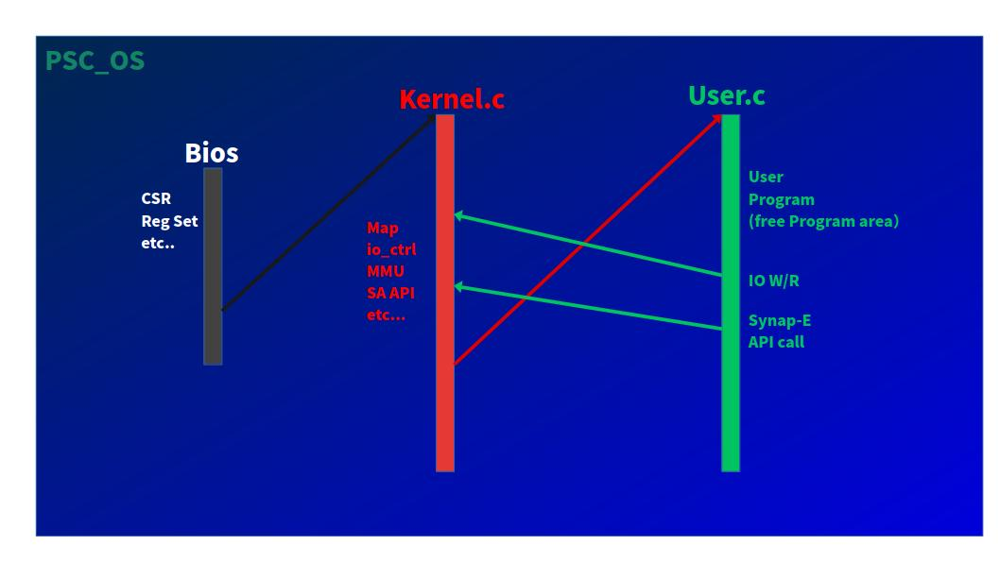

<p align="center">
  <a href="https://github.com/QPSC-Design/PSC-ONE">
    
  </a>
</p>

# PSC-ONE Software

This directory contains the software stack of **PSC-ONE**, a fully custom-designed RISC-V based system.

Unlike conventional projects that rely on existing operating systems, PSC-ONE implements a **completely original operating system** from scratch, tightly integrated with its custom hardware architecture.

---

## Overview

  
PSC-ONE Software is a **full-stack OS environment** designed for a custom FPGA-based SoC.

It includes:

- Bootloader
- Kernel
- User programs
- System libraries

The figure below illustrates the overall PSC-ONE software architecture,  
including the bootloader, kernel, user-space applications, and system libraries.  
  
  

All components are developed specifically for PSC-ONE, without depending on existing OS frameworks such as Linux or BSD.  
  
---

## Key Features

### 1. Fully Custom OS

PSC-ONE does **not use any existing operating system**.

- No Linux
- No RTOS
- No external kernel base

Every layer, from boot to user space, is implemented independently to enable full control over system behavior and architecture.

---

### 2. RISC-V Privilege Architecture (M / S / U)

PSC-ONE correctly implements the **RISC-V privilege model**:

- **M-mode (Machine mode)**  
  - Boot and low-level control  
  - Trap handling and system initialization  

- **S-mode (Supervisor mode)**  
  - Kernel execution  
  - System services and resource management  

- **U-mode (User mode)**  
  - User applications  
  - Isolated execution environment  

This separation enables a clean and extensible OS design aligned with real-world CPU architectures.

---

### 3. Virtual Memory Support

PSC-ONE is designed with **virtual memory architecture** in mind.

- Address translation abstraction
- Memory isolation between kernel and user space
- Foundation for future MMU-based extensions

This allows the system to evolve toward more advanced OS features such as process management and protection.

---

### 4. Hardware/Software Co-Design

The OS is tightly coupled with the custom hardware:

- Custom CPU core
- Custom memory system
- Custom peripherals

This enables:

- Deterministic behavior
- Efficient low-level control
- Experimental architecture exploration

---

### 5. Open Source

PSC-ONE Software is **fully open source**.

- All source code is publicly available
- Designed for learning, experimentation, and research
- Encourages contributions and modifications

---

### 6. Boot 

The following log shows PSC-OS being loaded from an SD card and booted while connected to a PC via UART.  

```text
boot start

=== PSC bootloader start ===
CTRL=0000000A
SD INIT start
LOAD: LBA=00000064 count=00000024 -> addr=00200000
RD[00000000] = 00256537
RD[00000004] = B1450513
RD[00000008] = 00050113
RD[0000000C] = 5000106F
RD[00000010] = 100005B7
RD[00000014] = 0085A603
RD[00000018] = 00167613
RD[0000001C] = 00060663
RD[00000020] = 00000013
RD[00000038] = FEABC4E3
RD[0000003C] = E05FF06F

....

CRC NG: lba=00000071 retry=00000000 sw=000062C5 hw=0000B418
RD[00000000] = 060080E7
RD[00000004] = 40A48533
RD[00000008] = 03056593
RD[0000000C] = 001A0513

....

WR[00000034] = 00000000
WR[00000038] = 00000000
WR[0000003C] = 00000000
bootloader: load done
kernel[0]=00256537
user[0]  =00422537
JUMP TO 00200000
Ver: test_1.4.2

00200000: 37 65 25 00 13 05 45 b1  13 01 05 00 6f 10 00 50  |7e%...E.....o..P|
00200010: b7 05 00 10 03 a6 85 00  13 76 16 00 63 06 06 00  |.........v..c...|
00200020: 13 00 00 00 6f f0 1f ff  23 a0 a5 00 67 80 00 00  |....o...#...g...|
00200030: b7 05 00 10 03 a6 85 00  13 76 16 00 63 06 06 00  |.........v..c...|
00200040: 13 00 00 00 6f f0 1f ff  23 a0 a5 00 67 80 00 00  |....o...#...g...|
00200050: 37 05 00 10 83 25 85 00  93 f5 25 00 63 96 05 00  |7....%....%.c...|
00200060: 13 00 00 00 6f f0 1f ff  03 25 45 00 13 75 f5 0f  |....o....%E..u..|
00200070: 67 80 00 00 13 01 01 ff  23 26 11 00 23 24 81 00  |g.......#&..#$..|
00200080: b7 55 22 00 03 c6 85 70  63 08 06 00 b7 55 22 00  |.U"....pc....U".|
00200090: 03 a4 c5 70 6f 00 40 01  13 06 10 00 23 84 c5 70  |...po.@.....#..p|
002000a0: b7 65 25 00 13 84 05 00  13 16 c5 00 33 05 c4 00  |.e%.........3...|
002000b0: b7 55 22 00 b7 66 35 00  93 86 06 00 23 a6 a5 70  |.U"..f5.....#..p|
002000c0: 63 f2 a6 02 37 35 20 00  13 05 15 12 b7 35 20 00  |c...75 ......5 .|
002000d0: 93 85 25 d3 13 06 90 08  97 10 00 00 e7 80 80 6d  |..%............m|
002000e0: 6f 00 00 00 13 05 04 00  93 05 00 00 97 10 00 00  |o...............|
002000f0: e7 80 80 5a 13 05 04 00  83 20 c1 00 03 24 81 00  |...Z..... ...$..|
PSC_OS Boot Start.........
--- memset ---

+--------------------------------------------------+
|                    PSC_OS                        |
|            Minimal RISC-V Kernel Boot            |
+--------------------------------------------------+
| Build : May  8 2026 15:01:36
| CPU   : RV32 (Supervisor mode)
| MMU   : SV32
| UART  : SBI console or
| UART  : MMIO console
| CMD   : hello, primes, dump, sa_start
| quit  : Ctl+A C. q.
+--------------------------------------------------+
--- create_process_1 ---
---- kernel map start. ----
---- MMIO map start. ----
---- SA core address map start. ----
---- SA core data address map start. ----
---- SA core data wb address map start. ----
---- SD-Card IF address map start. ----
create_process_End
--- create_process_2 ---
---- kernel map start. ----
---- MMIO map start. ----
---- SA core address map start. ----
---- SA core data address map start. ----
---- SA core data wb address map start. ----
---- SD-Card IF address map start. ----
---- user image map start. ----
---- user stack map start. ----
create_process_End
--- yield ---
shell start.
PSC_OS>
PSC_OS>
PSC_OS> primes 100
2 3 5 7 11 13 17 19
23 29 31 37 41 43 47 53
59 61 67 71 73 79 83 89
97
total primes: 25 (0..100)
PSC_OS> sd_read 0
CRC OK (retry=0)
00 00 00 00 00 00 00 00 00 00 00 00 00 00 00 00
00 00 00 00 00 00 00 00 00 00 00 00 00 00 00 00
00 00 00 00 00 00 00 00 00 00 00 00 00 00 00 00
00 00 00 00 00 00 00 00 00 00 00 00 00 00 00 00
00 00 00 00 00 00 00 00 00 00 00 00 00 00 00 00
00 00 00 00 00 00 00 00 00 00 00 00 00 00 00 00
00 00 00 00 00 00 00 00 00 00 00 00 00 00 00 00
00 00 00 00 00 00 00 00 00 00 00 00 00 00 00 00
00 00 00 00 00 00 00 00 00 00 00 00 00 00 00 00
00 00 00 00 00 00 00 00 00 00 00 00 00 00 00 00
00 00 00 00 00 00 00 00 00 00 00 00 00 00 00 00
00 00 00 00 00 00 00 00 00 00 00 00 00 00 00 00
00 00 00 00 00 00 00 00 00 00 00 00 00 00 00 00
00 00 00 00 00 00 00 00 00 00 00 00 00 00 00 00
00 00 00 00 00 00 00 00 00 00 00 00 00 00 00 00
00 00 00 00 00 00 00 00 00 00 00 00 00 00 00 00
00 00 00 00 00 00 00 00 00 00 00 00 00 00 00 00
00 00 00 00 00 00 00 00 00 00 00 00 00 00 00 00
00 00 00 00 00 00 00 00 00 00 00 00 00 00 00 00
00 00 00 00 00 00 00 00 00 00 00 00 00 00 00 00
00 00 00 00 00 00 00 00 00 00 00 00 00 00 00 00
00 00 00 00 00 00 00 00 00 00 00 00 00 00 00 00
00 00 00 00 00 00 00 00 00 00 00 00 00 00 00 00
00 00 00 00 00 00 00 00 00 00 00 00 00 00 00 00
00 00 00 00 00 00 00 00 00 00 00 00 00 00 00 00
00 00 00 00 00 00 00 00 00 00 00 00 00 00 00 00
00 00 00 00 00 00 00 00 00 00 00 00 00 00 00 00
00 00 00 00 00 00 00 00 93 0F E8 18 00 00 00 82
03 00 0C FE FF FF 00 20 00 00 00 B0 A3 03 00 00
00 00 00 00 00 00 00 00 00 00 00 00 00 00 00 00
00 00 00 00 00 00 00 00 00 00 00 00 00 00 00 00
00 00 00 00 00 00 00 00 00 00 00 00 00 00 55 AA
PSC_OS> sa_start
A
2 4 6 8 10 12 14 16 18 20 22 24
4 6 8 10 12 14 16 18 20 22 24 26
6 8 10 6 14 16 18 20 22 24 26 28
8 10 12 14 16 18 20 22 24 26 28 30
10 12 14 16 18 20 22 24 26 28 30 32
12 14 16 18 20 22 24 26 28 30 32 34
14 16 18 20 22 24 26 28 30 32 34 36
16 18 20 22 24 26 28 30 32 34 36 38
18 20 22 24 26 28 30 32 34 36 38 40
20 22 24 26 28 30 32 34 36 38 40 42
22 24 26 28 30 32 34 36 38 40 42 44
24 26 28 30 32 34 36 38 40 42 44 46

B
5 6 7 8 9 10 11 12 13 14 15 16
8 9 10 11 12 13 14 15 16 17 18 19
11 12 13 14 15 16 17 18 19 20 21 22
14 15 16 17 18 19 20 21 22 23 24 25
17 18 19 20 21 22 23 24 25 26 27 28
20 21 22 2 24 25 26 27 28 29 30 31
23 24 25 26 27 28 29 30 31 32 33 34
26 27 28 29 30 31 32 33 34 35 36 37
29 30 31 32 33 34 35 36 37 38 39 40
32 33 34 35 36 37 38 39 40 41 42 43
35 36 37 38 39 40 41 42 43 44 45 46
38 39 40 41 42 43 44 45 46 47 48 49

C
4212 4368 4524 4428 4836 4992 5148 5304 5460 5616 5772 5928
4728 4908 5088 4974 5448 5628 5808 5988 6168 6348 6528 6708
5160 5358 5556 5418 5952 6150 6348 6546 6744 6942 7140 7338
5760 5988 6216 6066 6672 6900 7128 7356 7584 7812 8040 8268
6276 6528 0 6612 0 7536 7788 8040 8292 8544 8796 9048
6792 7068 7344 7158 7896 8172 8448 8724 9000 9276 9552 9828
9048 7608 7908 7704 8508 8808 9108 9408 9708 10008 10308 10608
7824 8148 8472 8250 9120 9444 9768 10092 10416 10740 11064 11388
8340 8688 9036 8796 9732 10080 10428 10776 11124 11472 11820 12168
8856 9228 9600 9342 10344 10716 11088 11460 11832 12204 12576 12948
9372 9768 10164 9888 10956 11352 11748 12144 12540 12936 13332 13728
9888 10308 10728 10434 11568 11988 12408 12828 13248 13668 14088 14508

PSC_OS> dump
00200000: 37 65 25 00 13 05 45 b1  13 01 05 00 6f 10 00 50  |7e%...E.....o..P|
00200010: b7 05 00 10 03 a6 85 00  13 76 16 00 63 06 06 00  |.........v..c...|
00200020: 13 00 00 00 6f f0 1f ff  23 a0 a5 00 67 80 00 00  |....o...#...g...|
00200030: b7 05 00 10 03 a6 85 00  13 76 16 00 63 06 06 00  |.........v..c...|
00200040: 13 00 00 00 6f f0 1f ff  23 a0 a5 00 67 80 00 00  |....o...#...g...|
00200050: 37 05 00 10 83 25 85 00  93 f5 25 00 63 96 05 00  |7....%....%.c...|
00200060: 13 00 00 00 6f f0 1f ff  03 25 45 00 13 75 f5 0f  |....o....%E..u..|
00200070: 67 80 00 00 13 01 01 ff  23 26 11 00 23 24 81 00  |g.......#&..#$..|
00200080: b7 55 22 00 03 c6 85 70  63 08 06 00 b7 55 22 00  |.U"....pc....U".|
00200090: 03 a4 c5 70 6f 00 40 01  13 06 10 00 23 84 c5 70  |...po.@.....#..p|
002000a0: b7 65 25 00 13 84 05 00  13 16 c5 00 33 05 c4 00  |.e%.........3...|
002000b0: b7 55 22 00 b7 66 35 00  93 86 06 00 23 a6 a5 70  |.U"..f5.....#..p|
002000c0: 63 f2 a6 02 37 35 20 00  13 05 15 12 b7 35 20 00  |c...75 ......5 .|
002000d0: 93 85 25 d3 13 06 90 08  97 10 00 00 e7 80 80 6d  |..%............m|
002000e0: 6f 00 00 00 13 05 04 00  93 05 00 00 97 10 00 00  |o...............|
002000f0: e7 80 80 5a 13 05 04 00  83 20 c1 00 03 24 81 00  |...Z..... ...$..|
PSC_OS>
```

---

## Project Status

⚠️ This project is under active development.

The current implementation focuses on:

- Stable boot process
- Basic kernel functionality
- Hardware integration

---

## Future Work

The **main focus going forward is feature expansion**.

Planned areas include:

- Process management
- Memory management (full MMU support)
- File system integration
- Device driver improvements
- System call interface expansion
- AI accelerator integration (SynapEngine)

This repository is evolving toward a **complete experimental OS platform**.

---

## Philosophy

PSC-ONE Software is not just an OS implementation.

It is an attempt to:

- Understand systems from the ground up
- Explore hardware/software boundaries
- Build a fully transparent computing stack

---

## Directory Structure

```
os/
├── src/
├── build/
├── docs/
└── Makefile
```

---

## Related

- Hardware: `hardware/`
- Top-level project: PSC-ONE

---

## License

This project is released under an open-source license.
